# A2A-Aptos: Blockchain-Powered Agent Collaboration Platform

[](https://opensource.org/licenses/MIT)
[](https://www.python.org/downloads/)
[](https://aptos.dev/)
[](https://a2a.to/)

> **The first open-source platform to deeply integrate Google A2A Protocol with Aptos blockchain, providing decentralized trust infrastructure for multi-agent systems**

---

## 🚀 Project Overview

A2A-Aptos is a groundbreaking agent collaboration platform that deeply integrates **Google A2A (Agent-to-Agent) Protocol** with **Aptos high-performance blockchain**, solving core pain points of trust verification, task traceability, and value exchange in current AI Agent ecosystems.

### Core Value Propositions

- 🔐 **Blockchain Trust Mechanism**: Ed25519 digital signatures + on-chain task confirmation ensuring secure inter-agent communication
- ⚡ **High-Performance Architecture**: Millisecond-level transaction confirmation based on Aptos blockchain
- 🔄 **Standardized Protocol**: Fully compatible with Google A2A specifications, supporting seamless Agent integration
- 💰 **Value Incentives**: On-chain task bounty and automatic settlement mechanisms
- 🌐 **Ecosystem Expansion**: Plugin-based Agent architecture supporting multi-domain applications

---

## 🏗️ System Architecture

### Core Component Architecture

### Technology Stack Overview

| Layer | Technology Components | Description |
|-------|----------------------|-------------|
| **Blockchain Layer** | Aptos Blockchain | High-performance L1 blockchain supporting Move smart contracts |
| **Protocol Layer** | Google A2A Protocol | Standardized inter-agent communication protocol |
| **Framework Layer** | Google ADK | AI Agent Development Kit |
| **Application Layer** | Host Agent + Service Agents | Task coordinator + specialized service agents |
| **Security Layer** | Ed25519 + On-chain Verification | Digital signatures + blockchain task confirmation |

---

## 🔥 Core Technical Features

### 1. 🔐 Blockchain-Enhanced Trust Mechanism

#### Ed25519 Digital Signature Verification
- **Host Agent Signing**: Uses private key to sign `{agent_address}{session_id}`
- **Service Agent Verification**: Verifies signature source and session legitimacy
- **Replay Attack Prevention**: Session ID ensures uniqueness of each interaction

#### On-Chain Task Lifecycle Management
```
┌─────────────┐    ┌──────────────┐    ┌─────────────┐
│ Task Created │ -> │ Task Executed │ -> │ Task Completed │
│ create_task  │    │ Business Logic│    │ complete_task │
│ (Host Agent) │    │(Service Agent)│    │(Service Agent)│
└─────────────┘    └──────────────┘    └─────────────┘
```

### 2. ⚡ High-Performance Async Architecture

- **Concurrent Processing**: Supports parallel execution of multiple tasks
- **Streaming Communication**: Real-time task status updates (SSE)
- **Graceful Degradation**: Automatic switch to normal mode during blockchain failures
- **Intelligent Routing**: Automatic processing mode selection based on task type

### 3. 🔄 Standardized A2A Protocol Integration

#### Supported A2A Methods
| Method | Purpose | Blockchain Integration |
|--------|---------|----------------------|
| `tasks/send` | Synchronous task execution | ✅ Signature verification |
| `tasks/sendSubscribe` | Streaming task execution | ✅ Signature verification |
| `tasks/get` | Task status query | - |
| `tasks/cancel` | Task cancellation | 🔄 Planned |
| `/.well-known/agent.json` | Agent capability discovery | ✅ Includes blockchain address |

---

## 🌊 System Workflows

### Critical Task Flow (confirm_task)

Applicable scenarios: Tasks involving real-world operations (food ordering, ride-hailing, bookings, etc.)

```mermaid
sequenceDiagram
    participant U as 👤 User
    participant H as 🎯 Host Agent
    participant A as ⛓️ Aptos Blockchain
    participant S as 🤖 Service Agent
    
    Note over U,S: Critical Task Flow (confirm_task)
    
    U->>H: 1. Send task request<br/>"Order pizza from Za Pizza"
    
    Note over H: Intelligent routing determines<br/>blockchain confirmation needed
    
    H->>A: 2. create_task(task_id, agent, bounty)
    A-->>H: 3. Return transaction hash (tx_hash)
    
    Note over H: Generate Ed25519 signature<br/>{agent_address}{session_id}
    
    H->>S: 4. Send task + signature + blockchain confirmation
    
    Note over S: Verification phase
    S->>S: 5a. Verify Ed25519 signature
    S->>S: 5b. Verify blockchain transaction
    
    Note over S: Business processing
    S->>S: 6. Execute ordering logic
    
    S->>A: 7. complete_task(task_id)
    A-->>S: 8. Confirm and distribute APT reward
    
    S-->>H: 9. Return execution result + blockchain proof
    H-->>U: 10. Final result + tracking link
    
    Note over U,S: ✅ Task completed, fully traceable
```



### Information Query Flow (send_task)

Applicable scenarios: Pure information queries without blockchain confirmation needed


---

## 🛠️ Technology Stack

### Backend Technologies
- **Language**: Python 3.11+
- **AI Framework**: Google ADK (Agent Development Kit)
- **LLM**: Google Gemini 2.0 Flash
- **Blockchain**: Aptos Python SDK
- **Async**: asyncio + uvicorn
- **Cryptography**: PyNaCl (Ed25519 signatures)

### Blockchain Technologies
- **Smart Contracts**: Move language
- **Network**: Aptos Devnet (scalable to Mainnet)
- **Consensus**: AptosBFT v4 (Sub-second finality)
- **Signature Algorithm**: Ed25519

### Deployment Technologies
- **Containerization**: Docker + Docker Compose
- **Service Discovery**: A2A Agent Cards
- **Monitoring**: Structured logging + blockchain explorer integration

---

## 🚀 Quick Start

### Prerequisites

- Python 3.11+
- Google API Key (Gemini)
- Aptos CLI (optional)

### 1. Clone Repository

```bash
git clone https://github.com/your-org/A2A-Aptos.git
cd A2A-Aptos
```

### 2. Environment Configuration

```bash
# Copy environment template
cp .env.example .env

# Edit environment variables
export GOOGLE_API_KEY="your_google_api_key"
export APTOS_NODE_URL="https://api.devnet.aptoslabs.com/v1"
export APTOS_PRIVATE_KEY="ed25519-priv-0x..."
export APTOS_MODULE_ADDRESS="0x..."
```

### 3. Launch System

```bash
# Option 1: One-click start all components
./scripts/start_a2a_system.sh

# Option 2: Start separately
# Terminal 1: Start Food Agent
./scripts/run_food_agent.sh

# Terminal 2: Start Host Agent UI
./scripts/run_host_agent.sh
```

### 4. Access Interfaces

- **Host Agent UI**: http://localhost:8080
- **Food Agent API**: http://localhost:10003
- **Agent Cards**: http://localhost:10003/.well-known/agent.json

---

## 🎬 System Demonstrations

### Demo Videos

> **Note**: Actual demonstration videos will be inserted at the following locations

#### 1. Host Agent + Food Agent Interaction Demo
*[Insert complete Host Agent and Food Agent interaction flow video here]*

**Demo Highlights:**
- User initiates food ordering request
- Host Agent creates blockchain task
- Food Agent verifies signature and blockchain confirmation
- Completes order processing and blockchain task confirmation
- Real-time task status updates

#### 2. Host Agent + Uber Agent Interaction Demo
*[Insert complete Host Agent and Uber Agent interaction flow video here]*

**Demo Highlights:**
- Ride-hailing service request processing
- Intelligent task routing decisions
- Ed25519 signature verification process
- Blockchain task lifecycle management
- Error handling and graceful degradation

### Technical Highlight Showcase

- ✅ **Millisecond Blockchain Confirmation**: High-performance advantages of Aptos network
- ✅ **Zero Trust Architecture**: Every interaction has cryptographic verification
- ✅ **Plugin Extensibility**: Rapid integration of new Agent types
- ✅ **Complete Traceability**: All critical operations are verifiable on-chain


---

## 🤝 Contributing

We welcome contributions from the community! Please see [CONTRIBUTING.md](CONTRIBUTING.md) for detailed information.

### How to Participate

- 🐛 **Report Bugs**: Describe issues in detail in Issues
- 💡 **Feature Suggestions**: Propose new Agent types or functionality ideas
- 🔧 **Code Contributions**: Submit Pull Requests
- 📖 **Documentation Improvements**: Enhance technical docs and tutorials
- 🌐 **Community Building**: Promote the project, organize technical sharing

---

## 📄 License

This project is licensed under the [MIT License](LICENSE).

---

## 📞 Contact Us

- **Project Homepage**: https://github.com/PIN-AI/A2A-Aptos
- **Official Website**: https://www.pinai.io

---

<div align="center">

**🌟 If this project helps you, please give us a Star!**

[](https://github.com/PIN-AI/A2A-Aptos/stargazers)

</div> 